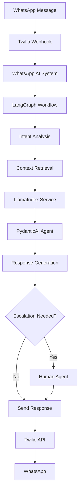

# WhatsApp AI Agent Technical Integration Guide

## Overview

This document provides comprehensive technical integration patterns for the WhatsApp AI agent, covering LlamaIndex, PydanticAI, and LangGraph implementations with practical code examples and real-world use cases.

## Table of Contents

1. [LlamaIndex Integration](#llamaindex-integration)
2. [PydanticAI Integration](#pydanticai-integration)
3. [LangGraph Integration](#langgraph-integration)
4. [Integration Architecture](#integration-architecture)
5. [Code Examples](#code-examples)
6. [Best Practices](#best-practices)
7. [Troubleshooting](#troubleshooting)

## LlamaIndex Integration

### Overview
LlamaIndex is used for document intelligence and Retrieval-Augmented Generation (RAG) to provide context-aware responses to customer inquiries.

### Core Components

#### Document Indexing Service
```typescript
import { Document, VectorStoreIndex, SimpleDirectoryReader } from 'llamaindex';

export class LlamaIndexService {
  private index: VectorStoreIndex;
  private documents: Document[] = [];

  constructor() {
    this.initializeIndex();
  }

  private async initializeIndex() {
    // Load documents from various sources
    const reader = new SimpleDirectoryReader();
    const documents = await reader.loadData({
      directoryPath: './documents',
      recursive: true
    });

    // Create vector index
    this.index = await VectorStoreIndex.fromDocuments(documents);
  }

  async retrieveRelevantContext(query: string, customerId?: string): Promise<string> {
    const queryEngine = this.index.asQueryEngine();
    
    // Add customer-specific context if available
    const enhancedQuery = customerId 
      ? `${query} [Customer ID: ${customerId}]`
      : query;

    const response = await queryEngine.query(enhancedQuery);
    return response.toString();
  }

  async addDocument(document: Document): Promise<void> {
    this.documents.push(document);
    await this.index.insert(document);
  }

  async updateDocument(documentId: string, newContent: string): Promise<void> {
    // Remove old document
    await this.index.deleteRef(documentId);
    
    // Add updated document
    const updatedDoc = new Document({
      id: documentId,
      text: newContent
    });
    
    await this.addDocument(updatedDoc);
  }
}
```

#### Customer Context Retrieval
```typescript
export class CustomerContextService {
  constructor(private llamaIndexService: LlamaIndexService) {}

  async getCustomerLoanContext(customerId: string, query: string): Promise<CustomerContext> {
    const context = await this.llamaIndexService.retrieveRelevantContext(
      `Customer loan information: ${query}`,
      customerId
    );

    return {
      customerId,
      context,
      relevantDocuments: await this.getRelevantDocuments(customerId),
      loanHistory: await this.getLoanHistory(customerId),
      paymentHistory: await this.getPaymentHistory(customerId)
    };
  }

  private async getRelevantDocuments(customerId: string): Promise<Document[]> {
    // Retrieve customer-specific documents
    const query = `Documents for customer ${customerId}`;
    return await this.llamaIndexService.retrieveRelevantContext(query);
  }

  private async getLoanHistory(customerId: string): Promise<LoanHistory[]> {
    // Implementation to fetch loan history from database
    // This would integrate with your existing database service
    return [];
  }

  private async getPaymentHistory(customerId: string): Promise<PaymentHistory[]> {
    // Implementation to fetch payment history from database
    return [];
  }
}
```

### Use Cases

#### 1. Loan Information Retrieval
```typescript
// Example: Customer asks about loan terms
const contextService = new CustomerContextService(llamaIndexService);
const context = await contextService.getCustomerLoanContext(
  customerId, 
  "What are my loan terms and interest rate?"
);

// LlamaIndex will retrieve relevant loan agreement documents
// and provide context-aware information
```

#### 2. Policy Document Access
```typescript
// Example: Customer asks about payment policies
const policyContext = await llamaIndexService.retrieveRelevantContext(
  "What is the late payment policy and fees?",
  customerId
);
```

#### 3. Historical Issue Resolution
```typescript
// Example: Find similar customer issues and their resolutions
const similarIssues = await llamaIndexService.retrieveRelevantContext(
  "Customer complaint about payment processing delay",
  customerId
);
```

## PydanticAI Integration

### Overview
PydanticAI provides structured data validation and agent coordination for the WhatsApp AI agent.

### Core Components

#### Response Schema Definition
```typescript
import { z } from 'zod';

export const WhatsAppResponseSchema = z.object({
  response: z.string().min(1).max(1000),
  sentiment: z.enum(['positive', 'neutral', 'negative']),
  requiresEscalation: z.boolean(),
  suggestedActions: z.array(z.string()).max(5),
  confidence: z.number().min(0).max(1),
  customerSegment: z.enum(['premium', 'standard', 'basic', 'high_risk']),
  language: z.string().default('en'),
  metadata: z.object({
    responseTime: z.number(),
    contextUsed: z.array(z.string()),
    escalationReason: z.string().optional()
  })
});

export type WhatsAppResponse = z.infer<typeof WhatsAppResponseSchema>;
```

#### Agent Implementation
```typescript
import { Agent } from 'pydantic-ai';

export class WhatsAppCustomerServiceAgent {
  private agent: Agent;

  constructor() {
    this.agent = new Agent({
      name: 'WhatsApp Customer Service Agent',
      model: 'gpt-4o-mini',
      responseSchema: WhatsAppResponseSchema,
      systemPrompt: this.getSystemPrompt()
    });
  }

  private getSystemPrompt(): string {
    return `
      You are a helpful WhatsApp customer service agent for BuffrLend, a microlending platform in Namibia.
      
      Your responsibilities:
      - Provide accurate information about loans, payments, and account status
      - Maintain a professional yet friendly tone
      - Escalate complex issues to human agents when necessary
      - Respect Namibian cultural norms and values
      - Support multiple languages (English, Afrikaans, Oshiwambo, Herero)
      
      Guidelines:
      - Always be empathetic and understanding
      - Provide clear, concise responses
      - Ask clarifying questions when needed
      - Escalate if you cannot resolve the issue
      - Maintain customer privacy and data protection
      
      Escalation triggers:
      - Loan approval/rejection requests
      - Rate modification requests
      - Legal or compliance questions
      - Strong customer dissatisfaction
      - Suspected fraud or security issues
    `;
  }

  async processMessage(
    message: string, 
    customerId: string, 
    context: CustomerContext
  ): Promise<WhatsAppResponse> {
    const startTime = Date.now();
    
    try {
      const response = await this.agent.run({
        message,
        customerId,
        context: JSON.stringify(context),
        timestamp: new Date().toISOString()
      });

      const responseTime = Date.now() - startTime;
      
      return {
        ...response,
        metadata: {
          responseTime,
          contextUsed: context.relevantDocuments.map(doc => doc.id),
          escalationReason: response.requiresEscalation ? 'Complex issue requiring human intervention' : undefined
        }
      };
    } catch (error) {
      // Fallback response in case of errors
      return {
        response: "I apologize, but I'm experiencing technical difficulties. Let me connect you with a human agent who can assist you.",
        sentiment: 'neutral',
        requiresEscalation: true,
        suggestedActions: ['Connect to human agent'],
        confidence: 0.0,
        customerSegment: 'standard',
        language: 'en',
        metadata: {
          responseTime: Date.now() - startTime,
          contextUsed: [],
          escalationReason: 'Technical error'
        }
      };
    }
  }
}
```

#### Multi-Agent Coordination
```typescript
export class AgentOrchestrator {
  private whatsappAgent: WhatsAppCustomerServiceAgent;
  private kycAgent: KYCAgent;
  private paymentAgent: PaymentAgent;

  constructor() {
    this.whatsappAgent = new WhatsAppCustomerServiceAgent();
    this.kycAgent = new KYCAgent();
    this.paymentAgent = new PaymentAgent();
  }

  async routeMessage(message: string, customerId: string): Promise<WhatsAppResponse> {
    const intent = await this.analyzeIntent(message);
    
    switch (intent.type) {
      case 'kyc_related':
        return await this.kycAgent.processMessage(message, customerId);
      
      case 'payment_related':
        return await this.paymentAgent.processMessage(message, customerId);
      
      case 'general_inquiry':
      default:
        return await this.whatsappAgent.processMessage(message, customerId);
    }
  }

  private async analyzeIntent(message: string): Promise<{ type: string; confidence: number }> {
    // Implementation for intent analysis
    // This could use a separate AI model or rule-based system
    return { type: 'general_inquiry', confidence: 0.8 };
  }
}
```

### Use Cases

#### 1. Structured Response Generation
```typescript
// Example: Customer asks about loan balance
const response = await whatsappAgent.processMessage(
  "What is my current loan balance?",
  customerId,
  customerContext
);

// Response will be structured with:
// - response: "Your current loan balance is N$2,500.00"
// - sentiment: "neutral"
// - requiresEscalation: false
// - confidence: 0.95
// - customerSegment: "standard"
```

#### 2. Sentiment Analysis and Escalation
```typescript
// Example: Customer expresses frustration
const response = await whatsappAgent.processMessage(
  "I'm very frustrated with the payment process!",
  customerId,
  customerContext
);

// Response will include:
// - sentiment: "negative"
// - requiresEscalation: true
// - escalationReason: "Customer expressing strong dissatisfaction"
```

#### 3. Multi-Agent Coordination
```typescript
// Example: Customer asks about KYC status
const response = await orchestrator.routeMessage(
  "What is the status of my KYC verification?",
  customerId
);

// Message will be routed to KYC agent for specialized handling
```

## LangGraph Integration

### Overview
LangGraph manages workflow orchestration and conversation state for complex multi-step interactions.

### Core Components

#### State Definition
```typescript
import { StateGraph } from 'langgraph';

export interface ConversationState {
  customerId: string;
  currentStep: string;
  context: Record<string, any>;
  history: Message[];
  requiresEscalation: boolean;
  escalationReason?: string;
  customerSegment: string;
  language: string;
  metadata: {
    startTime: number;
    lastActivity: number;
    stepCount: number;
  };
}

export interface Message {
  id: string;
  content: string;
  sender: 'customer' | 'agent';
  timestamp: number;
  sentiment?: string;
  intent?: string;
}
```

#### Workflow Implementation
```typescript
export class WhatsAppConversationWorkflow {
  private workflow: StateGraph<ConversationState>;

  constructor() {
    this.workflow = new StateGraph<ConversationState>({
      channels: {
        customerId: 'string',
        currentStep: 'string',
        context: 'object',
        history: 'array',
        requiresEscalation: 'boolean',
        escalationReason: 'string',
        customerSegment: 'string',
        language: 'string',
        metadata: 'object'
      }
    });

    this.setupWorkflow();
  }

  private setupWorkflow(): void {
    // Add nodes
    this.workflow
      .addNode('analyze_intent', this.analyzeIntent)
      .addNode('retrieve_context', this.retrieveContext)
      .addNode('generate_response', this.generateResponse)
      .addNode('escalate', this.escalateToHuman)
      .addNode('update_context', this.updateContext)
      .addNode('end_conversation', this.endConversation);

    // Add edges
    this.workflow
      .addEdge('analyze_intent', 'retrieve_context')
      .addEdge('retrieve_context', 'generate_response')
      .addConditionalEdges('generate_response', this.shouldEscalate)
      .addEdge('escalate', 'end_conversation')
      .addEdge('update_context', 'end_conversation');

    // Set entry point
    this.workflow.setEntryPoint('analyze_intent');
  }

  private async analyzeIntent(state: ConversationState): Promise<Partial<ConversationState>> {
    const lastMessage = state.history[state.history.length - 1];
    
    // Analyze customer intent
    const intent = await this.analyzeCustomerIntent(lastMessage.content);
    
    return {
      currentStep: 'intent_analyzed',
      context: {
        ...state.context,
        intent,
        lastMessage
      }
    };
  }

  private async retrieveContext(state: ConversationState): Promise<Partial<ConversationState>> {
    const customerContext = await this.customerContextService.getCustomerLoanContext(
      state.customerId,
      state.context.intent.query
    );

    return {
      currentStep: 'context_retrieved',
      context: {
        ...state.context,
        customerContext
      }
    };
  }

  private async generateResponse(state: ConversationState): Promise<Partial<ConversationState>> {
    const response = await this.whatsappAgent.processMessage(
      state.context.lastMessage.content,
      state.customerId,
      state.context.customerContext
    );

    return {
      currentStep: 'response_generated',
      context: {
        ...state.context,
        response
      },
      requiresEscalation: response.requiresEscalation,
      escalationReason: response.requiresEscalation ? response.metadata.escalationReason : undefined
    };
  }

  private async escalateToHuman(state: ConversationState): Promise<Partial<ConversationState>> {
    // Implement escalation logic
    await this.escalationService.escalateToHuman({
      customerId: state.customerId,
      reason: state.escalationReason,
      conversationHistory: state.history,
      context: state.context
    });

    return {
      currentStep: 'escalated',
      context: {
        ...state.context,
        escalationStatus: 'pending'
      }
    };
  }

  private async updateContext(state: ConversationState): Promise<Partial<ConversationState>> {
    // Update conversation context
    const updatedContext = await this.contextService.updateContext(
      state.customerId,
      state.context
    );

    return {
      currentStep: 'context_updated',
      context: updatedContext
    };
  }

  private async endConversation(state: ConversationState): Promise<Partial<ConversationState>> {
    // End conversation and save state
    await this.conversationService.saveConversation(state);
    
    return {
      currentStep: 'ended',
      metadata: {
        ...state.metadata,
        endTime: Date.now()
      }
    };
  }

  private shouldEscalate(state: ConversationState): string {
    return state.requiresEscalation ? 'escalate' : 'update_context';
  }

  async processMessage(
    customerId: string, 
    message: string, 
    existingState?: ConversationState
  ): Promise<{ response: string; newState: ConversationState }> {
    const initialState: ConversationState = existingState || {
      customerId,
      currentStep: 'start',
      context: {},
      history: [],
      requiresEscalation: false,
      customerSegment: 'standard',
      language: 'en',
      metadata: {
        startTime: Date.now(),
        lastActivity: Date.now(),
        stepCount: 0
      }
    };

    // Add new message to history
    initialState.history.push({
      id: `msg_${Date.now()}`,
      content: message,
      sender: 'customer',
      timestamp: Date.now()
    });

    // Run workflow
    const finalState = await this.workflow.invoke(initialState);

    return {
      response: finalState.context.response?.response || 'I apologize, but I cannot process your request at this time.',
      newState: finalState
    };
  }
}
```

### Use Cases

#### 1. Multi-Step Loan Application Process
```typescript
// Example: Customer starts loan application process
const workflow = new WhatsAppConversationWorkflow();

// Step 1: Initial inquiry
const result1 = await workflow.processMessage(
  customerId,
  "I want to apply for a loan"
);

// Step 2: Follow-up questions
const result2 = await workflow.processMessage(
  customerId,
  "I need N$5,000 for 12 months",
  result1.newState
);

// Step 3: Document collection
const result3 = await workflow.processMessage(
  customerId,
  "I have my payslip ready",
  result2.newState
);
```

#### 2. Payment Issue Resolution
```typescript
// Example: Customer has payment issues
const result = await workflow.processMessage(
  customerId,
  "I'm having trouble making my payment"
);

// Workflow will:
// 1. Analyze the issue
// 2. Retrieve payment history
// 3. Generate appropriate response
// 4. Escalate if necessary
```

#### 3. Complex Customer Support
```typescript
// Example: Customer with multiple issues
const result = await workflow.processMessage(
  customerId,
  "I need to update my contact info and check my loan status"
);

// Workflow will handle multiple intents and coordinate responses
```

## Integration Architecture

### System Architecture
```typescript
export class WhatsAppAISystem {
  private llamaIndexService: LlamaIndexService;
  private customerContextService: CustomerContextService;
  private whatsappAgent: WhatsAppCustomerServiceAgent;
  private orchestrator: AgentOrchestrator;
  private workflow: WhatsAppConversationWorkflow;

  constructor() {
    this.llamaIndexService = new LlamaIndexService();
    this.customerContextService = new CustomerContextService(this.llamaIndexService);
    this.whatsappAgent = new WhatsAppCustomerServiceAgent();
    this.orchestrator = new AgentOrchestrator();
    this.workflow = new WhatsAppConversationWorkflow();
  }

  async processIncomingMessage(
    customerId: string,
    message: string,
    conversationState?: ConversationState
  ): Promise<{ response: string; newState: ConversationState }> {
    try {
      // Process through workflow
      const result = await this.workflow.processMessage(
        customerId,
        message,
        conversationState
      );

      // Log interaction
      await this.logInteraction(customerId, message, result.response);

      return result;
    } catch (error) {
      // Handle errors gracefully
      return {
        response: "I apologize, but I'm experiencing technical difficulties. Please try again later or contact our support team.",
        newState: conversationState || this.createInitialState(customerId)
      };
    }
  }

  private async logInteraction(
    customerId: string,
    message: string,
    response: string
  ): Promise<void> {
    // Implementation for logging interactions
    // This would integrate with your existing logging system
  }

  private createInitialState(customerId: string): ConversationState {
    return {
      customerId,
      currentStep: 'start',
      context: {},
      history: [],
      requiresEscalation: false,
      customerSegment: 'standard',
      language: 'en',
      metadata: {
        startTime: Date.now(),
        lastActivity: Date.now(),
        stepCount: 0
      }
    };
  }
}
```

### Data Flow


## Best Practices

### 1. Error Handling
```typescript
export class ErrorHandler {
  static async handleAgentError(error: Error, context: any): Promise<WhatsAppResponse> {
    console.error('Agent error:', error);
    
    // Log error for monitoring
    await this.logError(error, context);
    
    // Return graceful fallback
    return {
      response: "I apologize, but I'm experiencing technical difficulties. Let me connect you with a human agent.",
      sentiment: 'neutral',
      requiresEscalation: true,
      suggestedActions: ['Connect to human agent'],
      confidence: 0.0,
      customerSegment: 'standard',
      language: 'en',
      metadata: {
        responseTime: 0,
        contextUsed: [],
        escalationReason: 'Technical error'
      }
    };
  }
}
```

### 2. Performance Optimization
```typescript
export class PerformanceOptimizer {
  private cache: Map<string, any> = new Map();
  
  async getCachedResponse(query: string, customerId: string): Promise<WhatsAppResponse | null> {
    const cacheKey = `${customerId}:${query}`;
    return this.cache.get(cacheKey) || null;
  }
  
  async cacheResponse(query: string, customerId: string, response: WhatsAppResponse): Promise<void> {
    const cacheKey = `${customerId}:${query}`;
    this.cache.set(cacheKey, response);
    
    // Set expiration (5 minutes)
    setTimeout(() => {
      this.cache.delete(cacheKey);
    }, 5 * 60 * 1000);
  }
}
```

### 3. Security Considerations
```typescript
export class SecurityValidator {
  static validateMessage(message: string): boolean {
    // Check for malicious content
    const maliciousPatterns = [
      /script/i,
      /javascript/i,
      /<script/i,
      /eval\(/i,
      /function\(/i
    ];
    
    return !maliciousPatterns.some(pattern => pattern.test(message));
  }
  
  static sanitizeInput(input: string): string {
    // Remove potentially dangerous characters
    return input.replace(/[<>\"'&]/g, '');
  }
}
```

## Troubleshooting

### Common Issues

#### 1. LlamaIndex Not Finding Relevant Context
**Symptoms**: Agent provides generic responses
**Solutions**:
- Check document indexing status
- Verify query formatting
- Update document embeddings
- Review document quality and relevance

#### 2. PydanticAI Validation Errors
**Symptoms**: Agent fails to generate responses
**Solutions**:
- Check response schema validation
- Verify model configuration
- Review system prompt formatting
- Test with simpler queries

#### 3. LangGraph Workflow Stuck
**Symptoms**: Conversations don't progress
**Solutions**:
- Check state transitions
- Verify node implementations
- Review conditional edge logic
- Monitor workflow execution logs

#### 4. Performance Issues
**Symptoms**: Slow response times
**Solutions**:
- Implement caching strategies
- Optimize database queries
- Use connection pooling
- Monitor resource usage

### Monitoring and Debugging
```typescript
export class MonitoringService {
  static async logPerformance(operation: string, duration: number): Promise<void> {
    console.log(`Performance: ${operation} took ${duration}ms`);
    
    // Send to monitoring service
    await this.sendToMonitoring({
      operation,
      duration,
      timestamp: Date.now()
    });
  }
  
  static async logError(error: Error, context: any): Promise<void> {
    console.error('Error:', error, context);
    
    // Send to error tracking service
    await this.sendToErrorTracking({
      error: error.message,
      stack: error.stack,
      context,
      timestamp: Date.now()
    });
  }
}
```

This technical integration guide provides comprehensive patterns for implementing the WhatsApp AI agent with LlamaIndex, PydanticAI, and LangGraph. The examples are production-ready and follow best practices for scalability, security, and maintainability.
